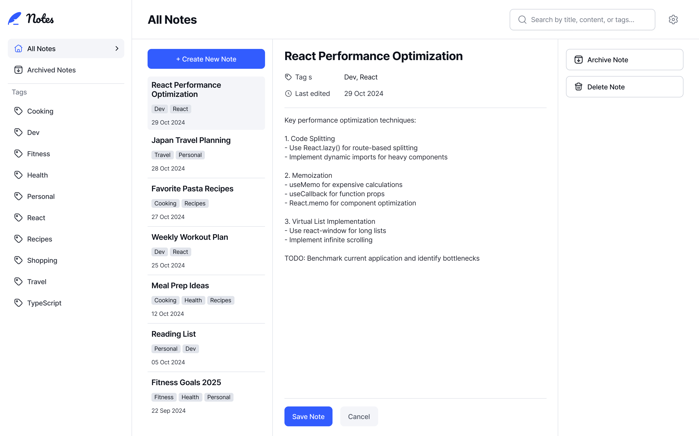

# Frontend Mentor - Note-taking web app solution

This is a solution to the [Note-taking web app challenge on Frontend Mentor](https://www.frontendmentor.io/challenges/note-taking-web-app-773r7bUfOG). Frontend Mentor challenges help you improve your coding skills by building realistic projects. 

## Table of contents

- [Overview](#overview)
  - [The challenge](#the-challenge)
  - [Screenshot](#screenshot)
  - [Links](#links)
- [My process](#my-process)
  - [Built with](#built-with)
  - [What I learned](#what-i-learned)
  - [Continued development](#continued-development)
  - [Useful resources](#useful-resources)
- [Author](#author)
- [Acknowledgments](#acknowledgments)

## Overview

### The challenge

Users should be able to:

- Create, read, update, and delete notes
- Archive notes
- View all their notes
- View all archived notes
- View notes with specific tags
- Search notes by title, tag, and content
- Select their color theme and save it (via cookies)
- Select their font theme and save it (via cookies)
- Receive validation messages if required form fields aren't completed
- Navigate the whole app and perform all actions using only their keyboard
- View the optimal layout for the interface depending on their device's screen size
- See hover and focus states for all interactive elements on the page
- Save details to a database (full-stack app)
- Create an account (Google), log in / log out

### Screenshot

### Links

- Solution URL: [Source code on Github](https://github.com/ortalyarts/frontendmentor-note-taking-web-app)
- Live Site URL: [App preview](https://frontendmentor-note-taking-web-app-topaz.vercel.app/)

## My process

### Built with

- [React](https://reactjs.org/) - JS library
- [Next.js](https://nextjs.org/) - React framework
- NextJS App router
- [Prisma ORM](https://www.prisma.io/docs/getting-started/setup-prisma/add-to-existing-project/relational-databases-typescript-postgresql) - for database management 
- Prisma - VS Code extention to syntax highlit the Prisma code
- Thunder Client - VS Code extention to test APIs
- [Prismaliser.app](https://d.docs.live.net/965CA39A0E977287/prismaliser.app)
- PostgreSQL – database
- [Neon](https://neon.tech/) – database hosting (serverless PostgreSQL, Vercel-friendly)
- [NextAuth.js](https://next-auth.js.org/) - Authentication
- NextJS API routing - for NextAuth.js
- OAuth on Google Cloud console - authentication to sign in with Google
- isomorphic-dompurify - to sanitize user created content
- [react-responsive](https://www.npmjs.com/package/react-responsive) - React package to render different layouts depending on the screen size
- zustand - React package to share state variables between components

## Author

- OrtalyARTS Portfolio Website - [@ortalyARTS.com](https://ortaly.com/)
- Frontend Mentor - [@ortalyARTS](https://www.frontendmentor.io/profile/ortalyARTS)
- Linkedin - [@ortalyARTS](www.linkedin.com/in/ortalyarts) 
